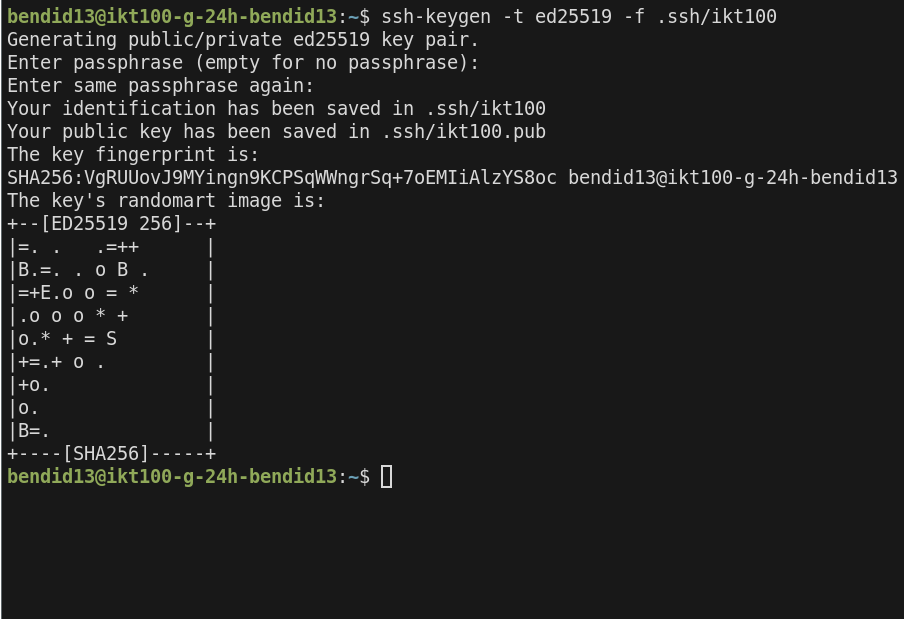
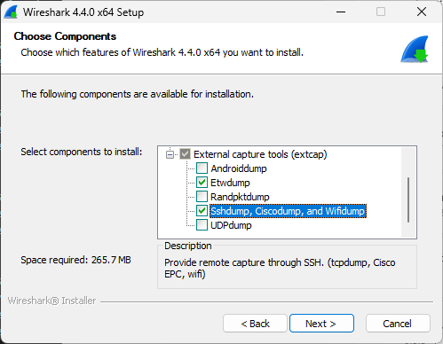
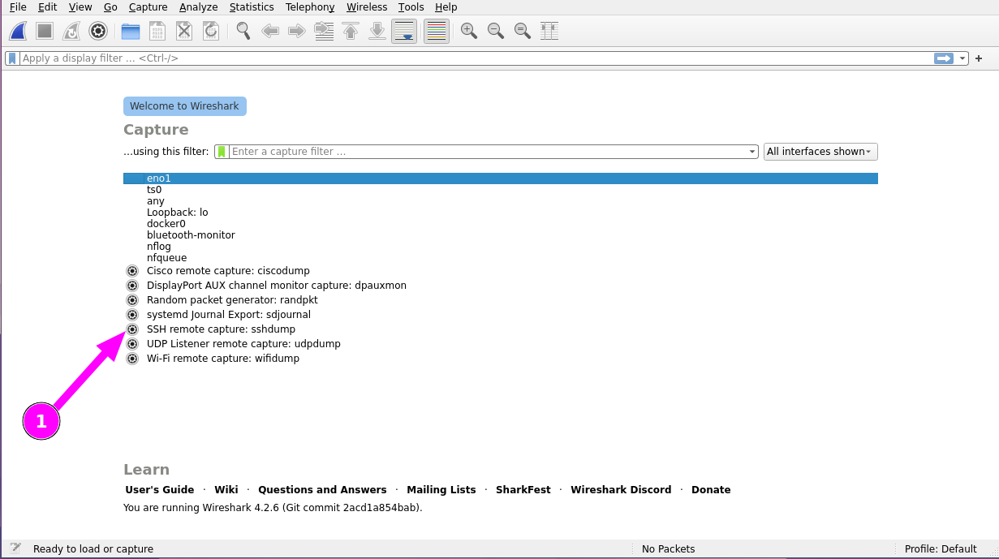
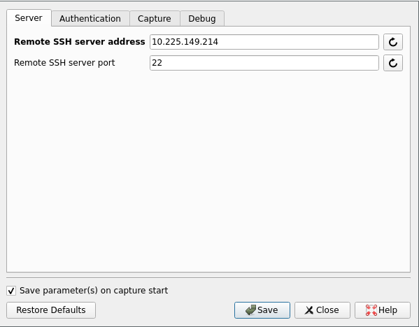
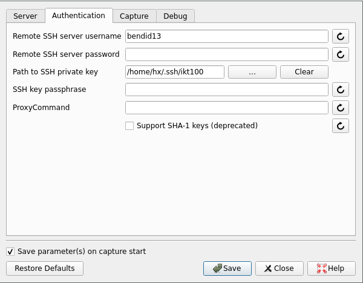
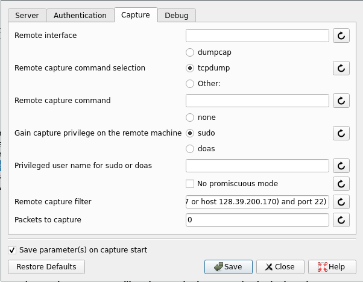

# Oppsett av SSH nøkkler og Wireshark SSH Remote Capture
> Denne guiden er ment for å gjøre klar den virtuelle maskinen til øving 3 i IKT100.

Før en kommer i gang her så må en først ha funnet IP'en til sin virtuelle maskin, dette vil en finne mer informasjon om [her](../vm.md)

---

## SSH Nøkkler
Når en skal sette opp bruk av ssh nøkkler for å logge seg på den virtuelle maskinen, så må en først og fremst passe på at en er logget inn på den virtuelle maskinen.

Før en begynner å lage ssh nøkklene så må en sørge for at ``.ssh`` mappen eksisterer. Dette kan en gjøre ved å skrive ``mkdir .ssh``, om den alt eksisterer så vil kommando'en gi output om at den klarer ikke å lage mappen, for den eksisterer alt. Om den ikke finnes så vil den bli laget, uten å gi noe output.

Her fra så vil en bruke kommando'en ``ssh-keygen`` denne kommandoen vil da lage et nøkkelpar en vil bruke til logge seg på den virtuelle maskinen med. Dette betyr da at en slipper å skrive passordet sitt.

???+ note
    I et ssh nøkkelpar så består det av en private nøkkel, og en public nøkkel. Den private nøkkelen skal en aldri dele med andre enn seg selv. Mens public nøkkelen kan en dele med hvem en vil.

Når en skal begynne å lage ssh nøkkelparet, så skal en bruke denne kommandoen``ssh-keygen -t ed25519 -f .ssh/ikt100``.
Det denne kommandoen gjør er at den lager et nøkkelpar med kryptering ed25519, og legger privat- og public nøkkelen i .ssh mappen og gir den navnet ikt100.

Når en kjører kommandoen vil en få spørsmål om å oppgi en passphrase, dette er ment for å gjøre ssh nøkkelen sikkrere. For skulle den komme på avveie så kan hvem som helst bruke den til å logge inn på alle serveren hvor dens sin public nøkkel blir brukt. Det er ikke et krav om å ha passphrase, så her trenger en ikke å skrive inn noe og kan trykke seg forbi denne.

Nå kan en sjekke .ssh mappen med ``ls .ssh`` for å se at det har nå blitt laget to filer.
- ikt100
  - private nøkkel
- ikt100.pub
  - public nøkkel

privat nøkkelen skal en aldri dele med andre enn seg selv, mens da public nøkkelen kan en gi til alle hvor en har behov for å logge seg på de/dems sin linux maskin.

Så nå for å gi laptopen din tilgang til å koble seg på den virtuelle maskinen så må du legge public nøkkelen i en fil som heter authorized_keys på den virtuelle maskinen, denne filen skal ligge i .ssh mappen. Først må en passe på at en står i .ssh mappen. Så kan en kjøre denne kommandoen for å legge ikt100 public nøkkelen ligger i authorized_keys  ``cat ikt100.pub >> authorized_keys``.

Nå mangler en bare å legg privat nøkkelen inn på maskinen sin. Dette er da filen med navn ikt100

### Windows
En begynner med å åpne opp cmd, og ...w

<!-- windows+r
skriver cmd
lage .ssh
notepad ikt100
paste inn privat nøkkel fra virtuelle maskin, og passe på at det er linje skjift (ha dette med warning admotions.) -->

### Macos
<!-- 
mod + space, skriver terminal
lage .ssh mappen
ikt100
paste inn privat nøkkel fra virtuelle maskin, og passe på at det er linje skjift -->

### Linux
<!-- 
åpner en terminal
lage .ssh mappen
vim ikt100
paste inn privat nøkkel fra virtuelle maskin
scp .ssh/ikt100 bendid13@10.225.149.214:.ssh/ikt100
    - .ssh/ikt100
        - hvor skal den ligger,
    - bendid13@10.225.149.214
      - brukernavn + ip fra hvilken virtuell maskin skal den hentes fra
    - .ssh/ikt100
      - hvor den skal hente fra.
-->

## Passordløs Sudo

## Wireshark SSH Remote Caputure

For å begynne å sette opp Wireshark SSH Remote Capture, så må en sørge for å ha installert Wireshark, https://www.wireshark.org/download.html

???+ warning
    På windows så er det viktigt at en huker av på komponenten, ``Sshdump, Ciscodump and Wifidump`` under installasjonen av Wireshark. Dette er ikke nødvendigt på macos eller linux.

Etter en har installert Wireshark, så kan en starte opp programmet og det vil se slikt ut når en åpner det.

Så for å sette opp SSH Remote Capture, så trykker en på tannhjulet til venstre for ``SSH remote capture: sshdump`` som er markert på skjermbildet (1).

Herfra vil en bli møtt med en nytt vindu, hvor en da må fylle inn ip addressen til sin virtuelle maskin inn i feltet ``Remote SSH server address``

Så må en trykke seg over til ``Authentication`` fanen

Her må en fylle inn ditt uia brukernavn under ``Remote SSH server username`` og så legge inn stian til ssh nøkkelen under ``Path to SSH private key``, en vil finne den på disse stiene.

- Linux
  - ``/home/bendid13/.ssh/ikt100``
- Macos
  - ``/Users/bendid13/.ssh/ikt100``
- Windows
  - ``C:\Users\bendid13\.ssh\ikt100``

Så må en videre til ``Capture`` fanen.
Her må en passe at ``Remote capture command selection`` er satt til tcpdump og,``Gain capture privilege on the remote machine`` er satt til sudo.
 Så er det bare å trykke Save.

Så nå kan en bare trykke på navnet ``SSH Remote Capture: sshdump``

