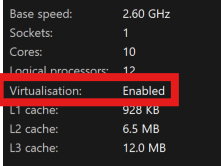

##  WSL2 (Windows)
Windows har kommet med WSL (Windows Subsystem for Linux) dette lar deg kjøre linux på en windows maskin. En er ikke bundent til et type distro men Ubuntu LTS er default med installasjon.

[How to install Linux on Windows with WSL](https://learn.microsoft.com/en-us/windows/wsl/install)

## Instalasjon
For å installere WSL2 er det noen krav for å kunne gjøre dette:
* CPU støtter virtualisering og er aktivert i bios. - Dette kan sjekkes med: Åpne ``Task manager`` naviger til ``Performance`` og velg `CPU` 

For å starte installasjonen er det ambefalt å starte `cmd` eller `powershell` som admin også skrive kommandoen ``wsl --install``