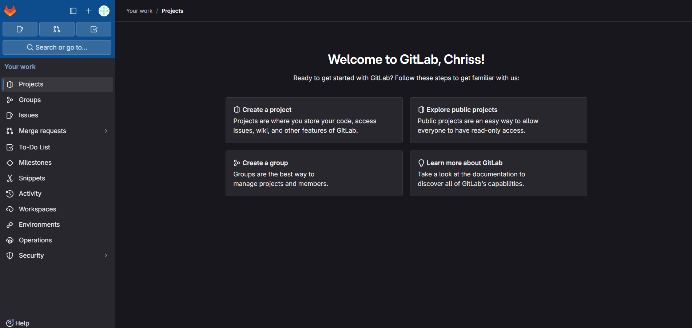
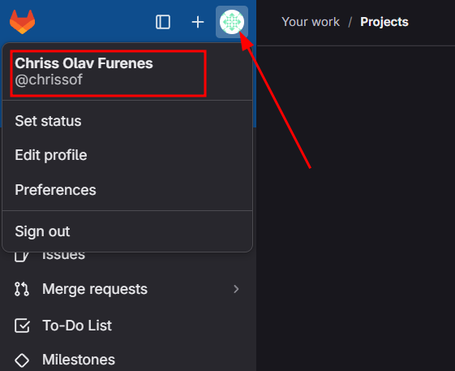
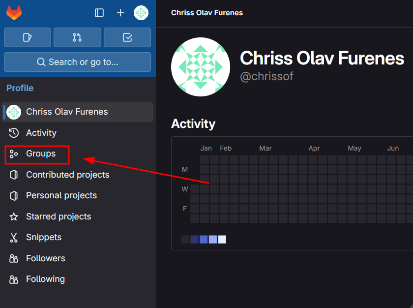
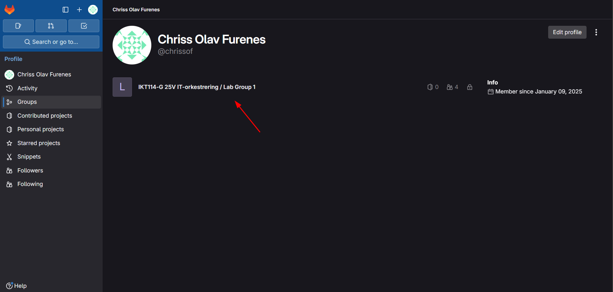

# Hvordan finne gruppen min i GitLab

Du logger inn på [GitLab](https://gitlab.internal.uia.no/) med UIA brukeren din.

Du er nå kommet til fremsiden din der prosjekene dine vil vises

Her klikker man på ikonet som illustrerer profilbilde ditt, også klikker du på navnet ditt. Da skal du komme til din profil

Når du er kommet til profilen din kan du klikke på feltet **Groups**

Her vil du se alle grupper du er med i

Det du og kan gjøre er å gå rett til gruppa med url'en: ``https://gitlab.internal.uia.no/ikt114-g-25v-it-orkestrering/LabGroup1`` Bytt ut tallet på slutten med ditt gruppe nummer.